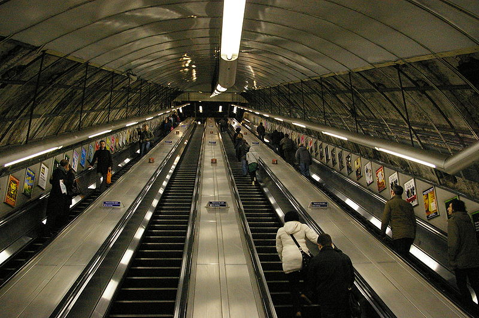
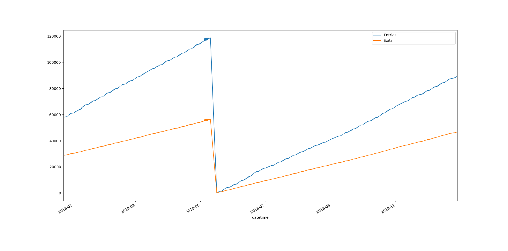
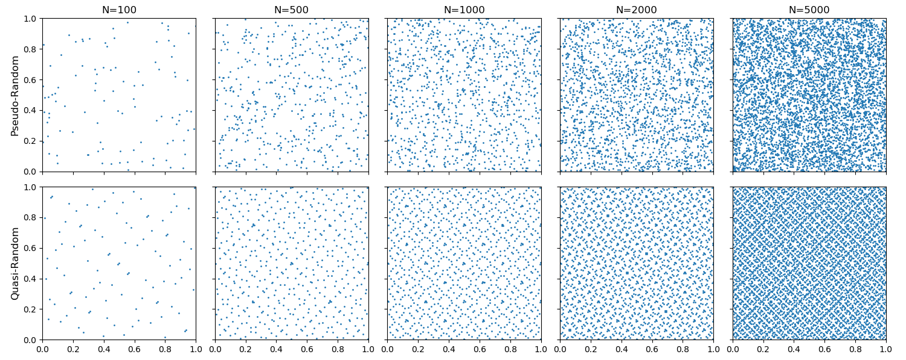
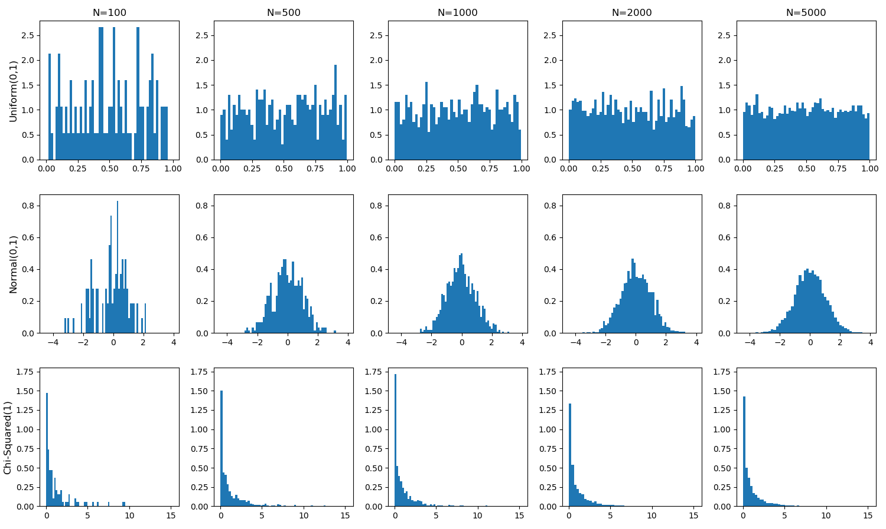
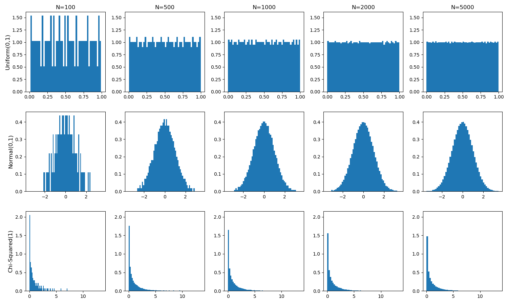

# Assignment 1 - Designing Models and Analyzing Data (Template)
(remove: **text between brackets to be removed**)

> * Participant name: Chathura Jayalath
> * Project Title: Subway Tunnel Optimization

# General Introduction

The first part of this assignment explores designing models (and basic Python/Git features). 

We will look at **subway model in a city** system. A **subway system** is an underground, tube, or metro, underground railway system used to transport large numbers of passengers within urban and suburban areas - modern subways use different types of electronic data collection sensors to supply information which is used to manage assets and resources efficiently. 

The second part of the assignment explores data analysis. Data analysis and visualization is key to both the input and output of simulations. This assignment explores different random number generators, distributions, visualizations, and statistics. Additionally, it will look at getting you accustomed to specifying input and output variables to a system. We will also practice working with real data.

# Part 1: Designing a Model - Subway System

## Problem Definition
The subway tunnel gets congested in busy times of the day, and delays people from reaching their destinations.
This is a problem in everyday life of passengers. Thse are related to problems which are even talked over news articles such as following: 
1. https://nyc.streetsblog.org/2018/01/02/why-congestion-pricing-wont-overwhelm-the-subways/
1. https://transitcenter.org/congestion-pricing-in-new-york-will-depend-on-more-and-better-transit/

## Goal/Aim
Reduce congestion and delay in the system.

### The objectives of the probject are to:
1. Minimize the delay of a passenger.
2. Maximize the rate of passengers passing though towards the trains.
3. Maximize the rate of passengers passing though away from the train.
4. Minimize the congestion in the escalator.
5. Minimize the congestion in the subway.

## Probable Solution
The manager of the tunnel escalater system is allowed to make decisions to control the rules of escalaters inorder to achive the above goal and objectives.

## Limitations and Scope
- The number of escalators is a fixed value for a given scenario.
- Number of lanes per escalator is two.
- Escalators could rotate in both directions, however changing the direction requires a special procdure.
- Different rules could be assigned to each lane of each escalator.
- The space reuiqred by a person is homogenous.
- The speed of walking is heterogenous.
- Lane changing (while in the middle of a lane) may be allowed or not as decided by the manager.
- Subway and other external entities have fixed known schedules with fluctuations.

## (Part 1.1): Requirements (Experimental Design) **(10%)**
The simulation will be run for a full factoral design of experiment by varying the number of escalators that are actively rotating and allowing walking lanes. Congestion values of the station area will be recorded.
These data will be statistically analyzed for figuring out which parameters give least amount of congestion.

## (Part 1.2) Subway (My Problem) Model **(10%)**

(remove: add a high-level overview of your model, the part below should link to the model directory markdown files)
(remove: Look at the [**Object Diagram**](model/object_diagram.md) for how to structure this part of Part 2 for each diagram. Only the Object diagram has the template, the rest are blank. )

* [**Object Diagram**](model/object_diagram.md) - provides the high level overview of components
* [**Class Diagram**](model/class_diagram.md) - provides details of (what are you providing details of)
* [**Behavior Diagram**](model/behavior_diagram.md) - provides details of (what are you providing details of)
* [**Agent / User case** (if appropriate)](model/agent_usecase_diagram.md) - provides details of (what are you providing details of)

## (Part 1.3) Subway (My Problem) Simulation **(10%)**
This will be an agent based simulation. Person will have two main tasks, going to train from the city and going to city from the train. One of these two will be the goal of the person. His behaviour could be either aggressive (wants to go as quickly as he can) or comfirt biasd (looks for less congested areas whenever he can and prefers slow and easy movement options). 
The train schedule and the amount of people who come to the station will be the input to the system.
The simulation will allow to calculate the congestion levels at each location on the station. Thse values will be the main outputs of the system.
These outputs will help in optimizing the system by calibrating the model parameters such as number of active escalaters.

## (Part 1.4) Subway City (My Problem) Model **(10%)**
[**Code template**](code/README.md) - Starting coding framework for the (insert your exact problem here.)
You are expected to create the python files - the code should run without errors, create and object(s) for your system, but not provide function detail.

## (Part 1.5) Specifying the Inputs to a System **(10%)**

(remove the below points once ideas are satisfied)
* What kind of statistics are important to capture this input data
* How do you plan to analyze the output of your model?
* What ways will you visualize your data - charts, and graphs you will create?
* What clever way will you visualize your output with a useful infographic?

Independent variables: 
1. Number of rotating escalators
2. Number of lanes allowed to walk

Dependent variables:
1. Congestion levels at locations (path nodes)
2. Number of ticks spent by a person in the station

The values for the independent variables will be defined synthetically as required for running a full factorial experiment.
A linear model will be used for analyzing the data for correlation between congestions since the independent variables are countable. Linear regression, correlation coefficients will be the statistical tools to use for this analysis.
Scatter plots of congetion, timeseries of congestion, box plot of congestion will be preferable graphs to analyze the data visually. 

# Part 2: Creating a Model from Code

## (Part 2.1) **P**ortable **O**rganic **T**rouble-free **S**elf-watering System (**POTS**) Model **(10%)**
Here [**we provide an overview**](code/POTS_system/README.md) of the **P**ortable **O**rganic **T**rouble-free **S**elf-watering System (**POTS**) Model and provide a source code template for the code found in  [**the following folder**](code/POTS_system/). Please create a **class** diagram of this model (replace the placeholder diagram). (you can use paper and pencil or a digital tool).

# Part 3: Data Analysis

## (Part 3.1) - Real Data **(10%)**

Find a datasource that looks at part of this model - subway stations locations / escalator number, heights, widths / volume of passangers - ridership numbers   (*fits* - we are pretty loose here, it can be anything.)

* Write up a paragraph that describes the data and how it fits into your system.
* Load the data into Python
* Calculate a few useful statistic on the data - keep it simple- STD, means, etc..., this is just designed * to get used to working with real data. Explain the insights you derive from these statistics.
* Visualize the raw data - visualize a few critical aspects of the data to better describe what it is, what it is showing, and why its useful to your system.
* Calculate and plot some summary statistics that better describe the data.

Data Source: https://data.ny.gov/Transportation/Turnstile-Usage-Data-2018/bjcb-yee3

This data is provided by the data.gov website for public use. The data gives information about how many people entered or exited through the turnstile in 2018, in the New York metropolitan area. The data contains 107 rows of data where each row shows the cumulative number of Exits and Entries through the turnstiles at a given date-time at a given line of a given station. This data will provide insight to how many people are coming in and leaving a given station. With it a general rate of entries and exits could be determined for a given time of a weekday. This will be considered when optimizing the congestion control with the model that I am designing. The values directly could be applied to the model as input to see how well it would handle the incoming crowds and how the congestion levels of certain areas in the station are affected.

By analysing the data, I picked the specific station JAMAICA 179 ST and the device SCP:00-00-06 in that station for the data analysis since it has enough data for pre-analysis for the model development. This file is located at : 
The basic statistics of Entries and Exits values are given below:

Median of Entries : 67556.0
Mean of Entries : 64276.27
Standard Deviation of Entries : 33271.63

Median of Exits : 33672.0
Mean of Exits : 31937.00
Standard Deviation of Exits : 15782.89

The high std dev values are expected since these are cumulative values.

## (Part 3.2) -  Plotting 2D Random Number Generators **(15%)**

This portion of the assignment looks at generating random numbers in Python and understanding how to properly plot them. Plot two different random numbers, pseudo random and quasi random, for five different N values. There should be 10 subplots, all properly formatted 2D plots. Note, each of the N points will have two coordinates, an x and a y, therefore you will need to generate two random numbers for each point. You should replace the image with your results in a simalar format. Discuss how the patterns differ. Feel free to change the N values from the suggested N values in the image to state your case.

### Discussion

I have used __*Mersenne Twister* random number generator__ (from `random` python library) as the __pseudo-random number generator__ and the __*Sobol* sequence generator__ (from `sobol_seq` python library) as the __quasi-random number generator__. Source code located at: https://github.com/IDS6145-Fall2019/assignment1-deamonpog/tree/design0/code/RandomNumbers

The pseudo random generator output seems to have no pattern and looks more organic/natrual when compared to the quasi random generator output.

The quasi-random number generator output shows patterns when the number of datapoints are 500, 1000 and 2000. However, such patterns are not clearly visible when there are 100 datapoints probably due to less detail. When the datapoints are 5000, the pattern is slightly visible but not clear probably due to the high density of datapoints. Moreoever, the pattern observed changes with the number of datapoints. 

The patterns that appear in quasi-random output feels more artificial while the pseudo-random output feels more natural and organic.

## (Part 3.3) -  Plotting 1D Random Distributions **(15%)**

Now, choose three different distributions to plot in 1D, or as a histogram. Choose a pseudo-random generator and generate three different distributions. Example distributions are Uniform (part 8), Normal, Exponential, Poisson, and Chi-Squared, but feel free to use any three distributions of your choice. Again, plot each distribution for five different Ns. This will result in 15 different subplots, formatted similar to the image in Part 8. Include your properly formmated 1D plots below and breifly describe what we are looking at and how things change as N is changed.

### Discussion

The figure above shows normalized histograms of Pseudo random samples of Uniform(0,1), Normal(0,1) and Chi-Squared(1) distributions. They were generated using `numpy` and `random` python libraries and plotted with `matplotlib` python library.

The first row shows Uniform distribution sampling. The parameters used for Uniform distribution are: a = 0, b = 1 which defines a uniform distribution between the values of 0 and 1. At low N values, the uniformity is not observed. The instance in which the plots were drawn, the probability density of graph where N = 100 has more irregular shape compared to N = 5000 (when N = 5000 the plot is more similar to the ideal uniform plot. As the number of instances increases the fairness of the random number generator has increased.

The second row shows Normal distribution sampling. The parameters used for Normal distribution are: mean = 0.0 and standard deviation = 1.0 which defines the standard bell curve. At low N values the plot doesn't resemble a bell curve at all. It has both very high spikes and zero values closer to the mean. As N increases, the shape of a bell curve is formed. However, it still is not anywhere close to ideal and there are clearly visible irregularities.

The third row shows Chi-Squared distribution sampling. The parameters used for Chi-Squared distribution is: degrees of freedom = 1.0. At low N values irregularities are observed although they are not so visible as for other distributions due to the inherent ideal shape of chi-squared distribution. The shape quickly converges to a better approximation of the ideal chi-squared curve as the N increases.

**Repeat the above using a quasi-random generator. Discuss the similarities and differences.**

### Discussion

The figure above shows normalized histograms of Quasi random samples of Uniform(0,1), Normal(0,1) and Chi-Squared(1) distributions. They were generated using `chaospy` python library and plotted with `matplotlib` python library.

Similar to the three cases discribed in the previous section, irregularities are observed when N values are smaller for all three cases and they decrease (become more similar to ideal shapes) as the N increases.

However, the irregularities are more symmetric in the quasi random generator compared to its psuedo random generator respectively. Moreover it should be noted that there are no zero values in all cases of the N values chosen with quasi random generator while zero values and isolated very high values are observed in the pseudo random generator case. Instead of generating isolated very high values, the quasi random generator has generated a series of high values which have the same high probability. And that high probability is lesser than the very high value generated by pseudo random generator (e.g. in case of N=100 for Uniform distribution, the high vlaue in pseudo random generator is ~2.5 while the respective quasi random generator has a set of peaks which have a value of ~1.5).
Additionally it should be noted that for all three cases of distributions, the randomness observed with the pseudo random generator looks less artifical compared to the quasi random variable.
