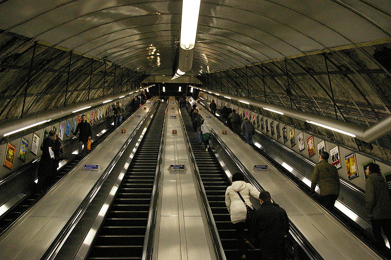

## Problem Definition
The subway tunnel gets congested in busy times of the day, and delays people from reaching their destinations.

## Goal/Aim
Reduce congestion and delay in the system.

### The objectives of the probject are to:
1. Minimize the delay of a passenger.
2. Maximize the rate of passengers passing though towards the trains.
3. Maximize the rate of passengers passing though away from the train.
4. Minimize the congestion in the escalator.
5. Minimize the congestion in the subway.

## Probable Solution
The manager of the tunnel escalater system is allowed to make decisions to control the rules of escalaters inorder to achive the above goal and objectives.

## Limitations and Scope
- The number of escalators is a fixed value for a given scenario.
- Number of lanes per escalator is two.
- Escalators could rotate in both directions, however changing the direction requires a special procdure.
- Different rules could be assigned to each lane of each escalator.
- The space reuiqred by a person is homogenous.
- The speed of walking is heterogenous.
- Lane changing (while in the middle of a lane) may be allowed or not as decided by the manager.
- Subway and other external entities have fixed known schedules with fluctuations.

