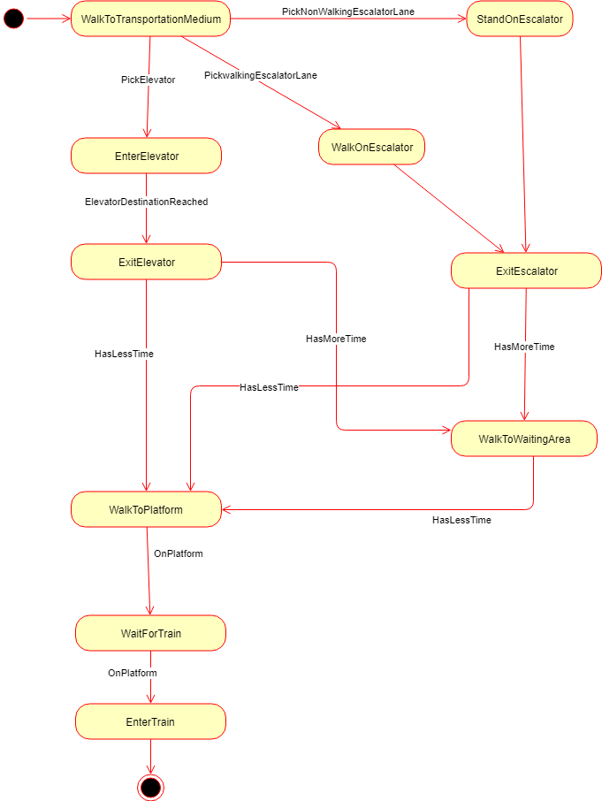

## Smart City Subway Congestoin Model - State Transition Diagram

The following diagram shows the state transition of a person who is going to a train from the city. The person enters the station at the start. The person object is destroyed at the exit point when the person enters the train since the simulation will not need it again. 

