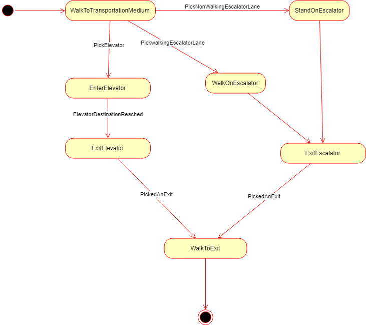

## Smart City Subway Congestoin Model - State Transition Diagram

The following diagram shows how the state transition of a person travelling from train to city. The person gets off from the train on to the platform at the start. The person object is destroyed when the person exits the station to city. 

